# Pega on AKS — C4 (C1–C4) + Sequence Diagrams

> Opinionated, vendor-aligned architecture sketches to understand **who talks to whom** and **why**. Diagrams use Mermaid. Assumes Pega 8.7+ on AKS with **externalized Kafka** (recommended) and SRS (Search & Reporting Service) backed by Elasticsearch/OpenSearch.

---

## C1 — System Context (AKS-hosted Pega Platform)

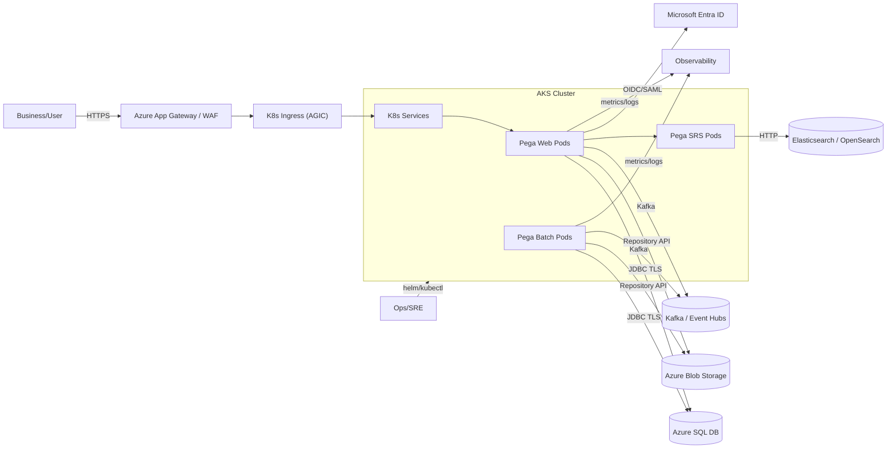

---

## C2 — Containers inside the System

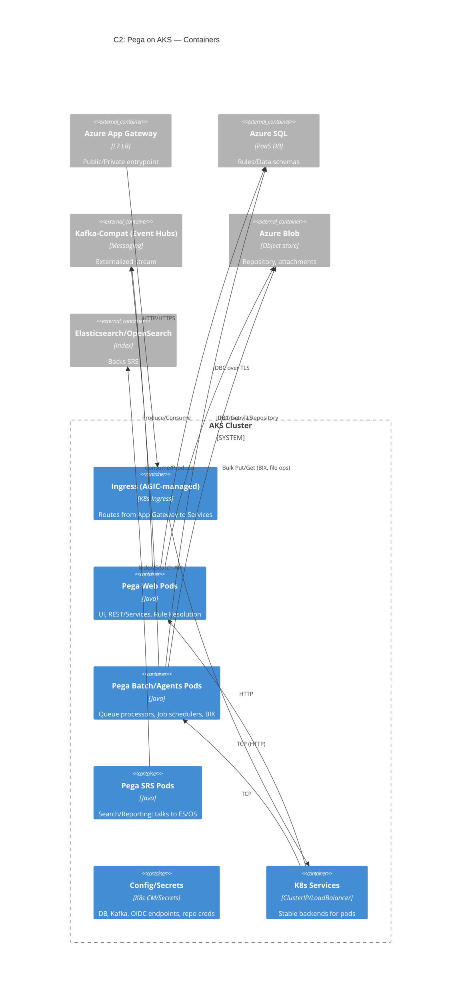

---

## C3 — Key Components per Container

### C3.1 Pega Web Pod Components

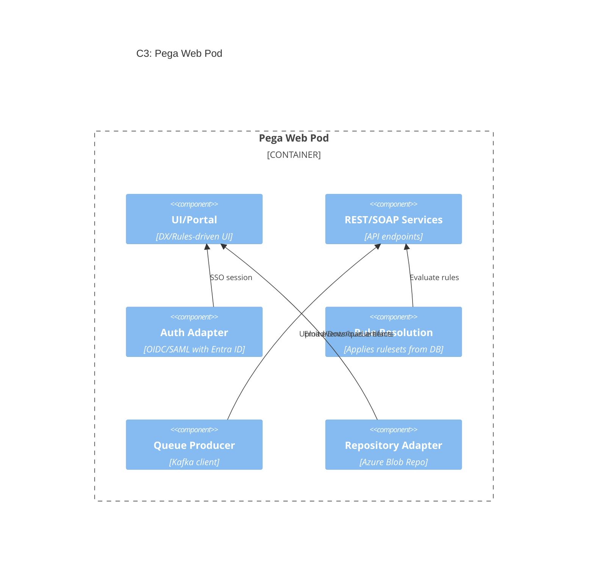

### C3.2 Pega Batch/Agents Pod Components

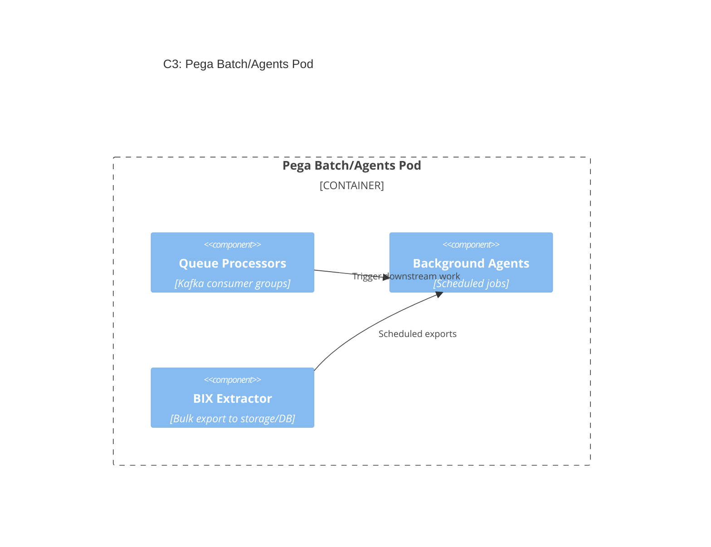

### C3.3 SRS (Search & Reporting Service)

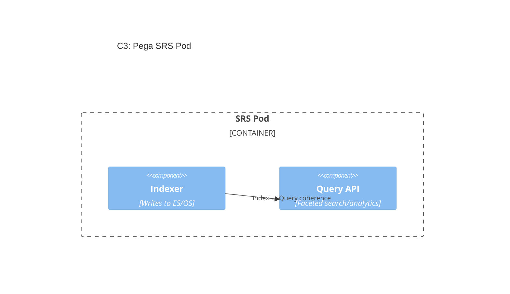

### C3.4 Ingress Path

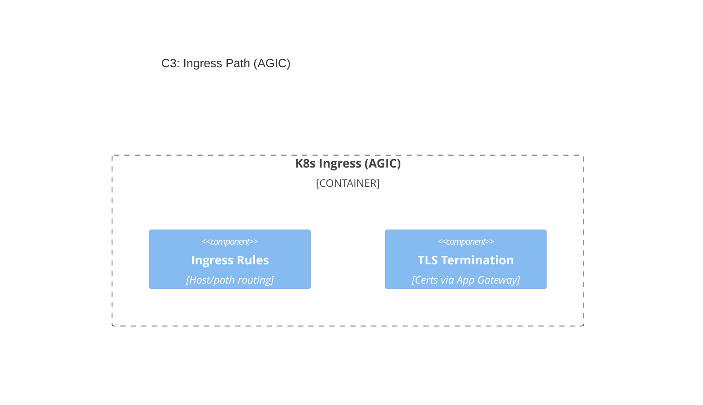

---

## C4 — Code/Deployment-Level View (K8s/Helm resources)

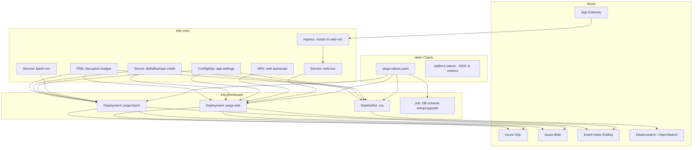

---

# Sequence Diagrams — Comprehensive Scenarios

## S1 — User Login & Portal Load (OIDC with Entra ID)

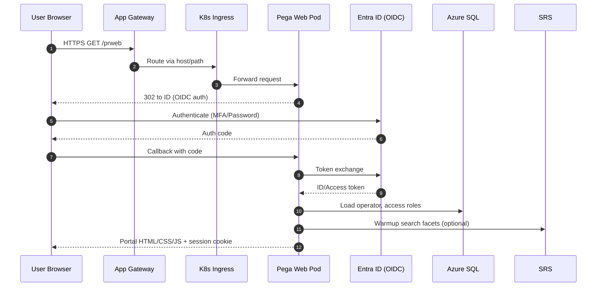

## S2 — Case Creation with Background Processing

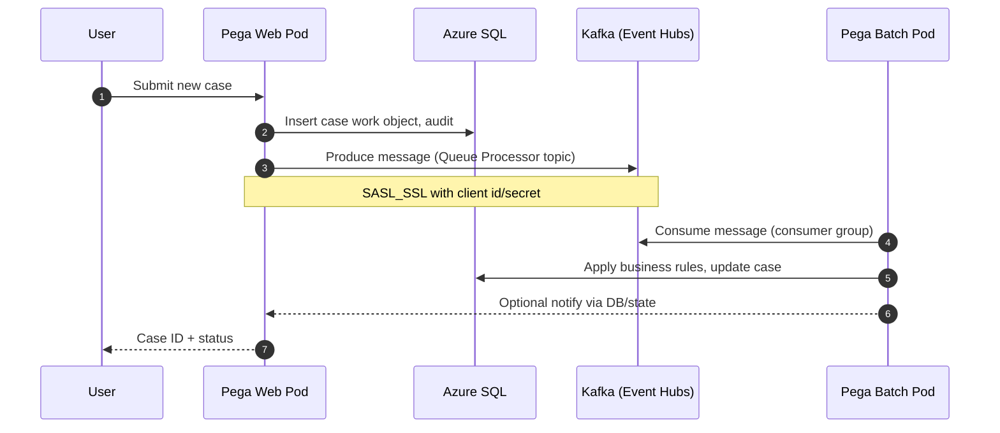

## S3 — File/Document Attachment to Azure Blob (Repository)

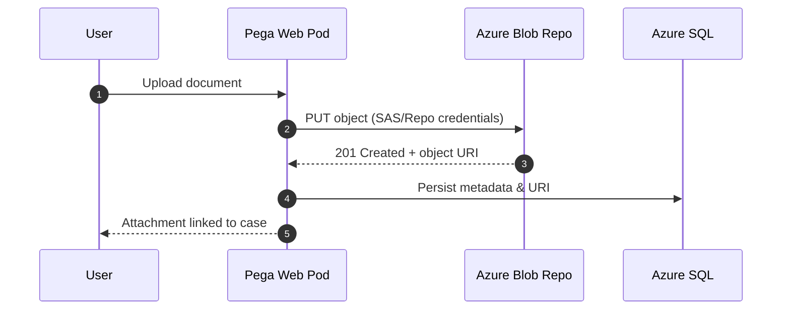

## S4 — Search/Reporting via SRS + Elasticsearch

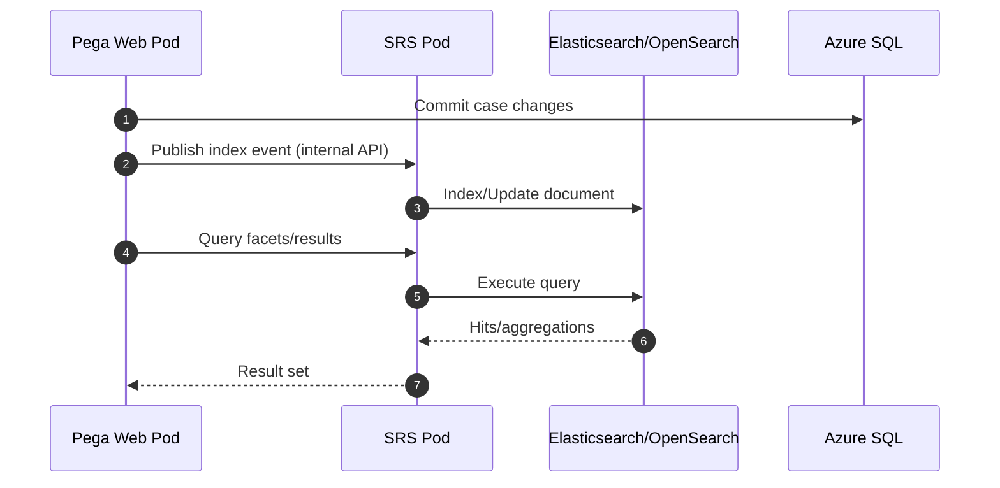

## S5 — Deployment/Upgrade via Helm (Schema, Rollout)

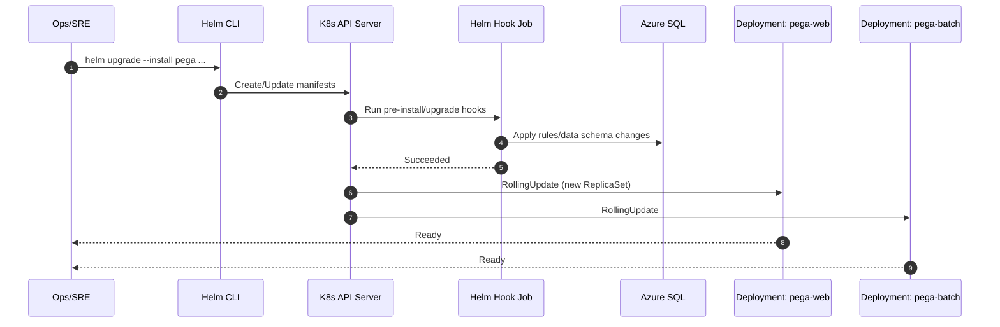

## S6 — Autoscaling Web Tier (HPA)

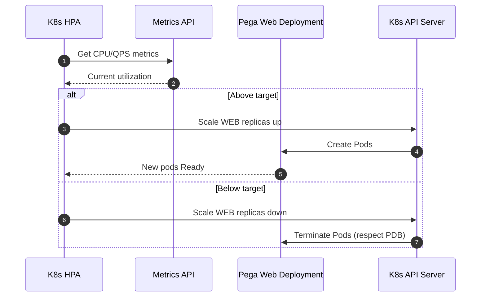

## S7 — Externalized Kafka vs Legacy Stream Tier

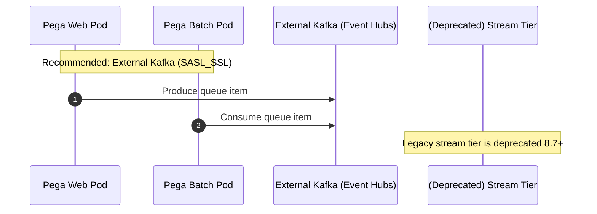

## S8 — Blue/Green or Canary via Helm Values

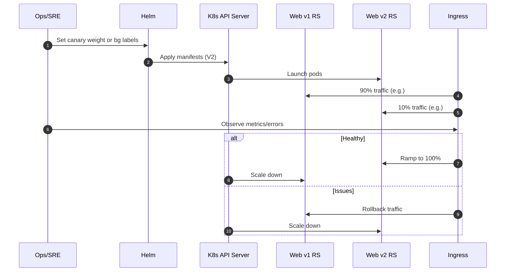

---

## Notes & Guardrails

* **Kafka**: Prefer **externalized** Kafka (e.g., Azure Event Hubs Kafka endpoint). Lock down with **SASL_SSL**, per-namespace creds.
* **Search**: Use **SRS** backed by **Elasticsearch/OpenSearch** managed service if available.
* **DB**: Separate **rules** and **data** schemas on **Azure SQL**; enforce TLS and least-privileged logins.
* **Ingress**: AGIC + App Gateway for enterprise-grade L7 WAF, path/host routing, TLS.
* **Scaling**: HPA for Web; Batch usually scales by throughput needs; protect with **PDB**, **Requests/Limits**, **Pod Anti-Affinity**.
* **Secrets**: Store in **K8s Secrets**; consider **Azure Key Vault CSI Driver** for rotation.
* **Upgrades**: Helm hooks must gate DB migrations; blue/green/canary to minimize risk.
* **Observability**: Ship **metrics/logs/traces** (Azure Monitor/Prom/Grafana/ELK).
* **Storage**: Prefer **Azure Blob** Repo for large attachments; DB BLOBs for simplicity-only PoCs.
* **Networking**: Private endpoints for SQL/Storage/Event Hubs where possible.

---

## Checklist to Map Doc → Values.yaml

* `provider: aks`
* `stream.enabled: false` and **externalized Kafka** block configured (bootstrap, securityProtocol, jaas, trust/key stores or EH SAS)
* `jdbc.url`, `jdbc.driverClass`, `jdbc.dbType: mssql`, `jdbc.driverUri`
* `global.search.externalSrs: true` (if chart supports) and ES endpoints for SRS
* `ingress:` (AGIC) host/path rules
* `repository:` section for Azure Blob Repo (account/SAS/container)
* `resources`, `affinity`, `tolerations`, `podDisruptionBudget` for each role
* `hpa:` for web tier; optional for batch
* `init/upgrade jobs:` enabled and ordered
